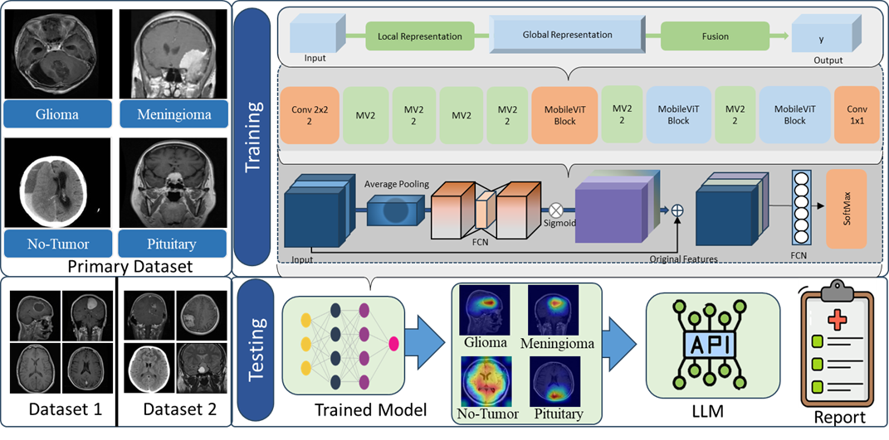

# TumorNet: A Hybrid Lightweight Framework for Brain Tumor Classification and Reasoning

**Muhammad Zaqeem · Hanxiang Wang · Muhammad Fayaz · Defu Qiu · Sajjad Ahadzadeh · Tan N. Nguyen · L. Minh Dang**

[](https://doi.org/10.1016/j.ins.2026.123423)
[](https://doi.org/10.1016/j.ins.2026.123423)

---

## Overview

TumorNet is a lightweight hybrid framework for brain tumor diagnosis from magnetic resonance imaging (MRI). It combines efficient convolutional feature extraction with MobileViT-based visual representation learning and attention-driven feature refinement. A reasoning component further provides an interpretable description of the model's diagnostic decision.

<p align="center">
  
</p>

---

## Framework

TumorNet integrates complementary components within a unified architecture:

- **CNN Stem** for low-level visual feature extraction
- **Multi-Scale Feature Learning** for complementary spatial representations
- **MobileViT-XXS** for lightweight global representation learning
- **Squeeze-and-Excitation (SE)** for channel-wise feature refinement
- **Feature Fusion** for combining discriminative representations
- **Reasoning Module** for generating an interpretable diagnostic description

---


---

## Citation

```bibtex
@article{Wang2026TumorNetAH,
  title={TumorNet: A hybrid lightweight framework for brain tumor classification and reasoning},
  author={Han-Xiang Wang and Muhammad Zaqeem and Muhammad Fayaz and De-Fu Qiu and Sajjad Ahadzadeh and Tan N. Nguyen and Lien Minh Dang},
  journal={Inf. Sci.},
  year={2026},
  volume={746},
  pages={123423},
  url={https://api.semanticscholar.org/CorpusID:286911924}
}
